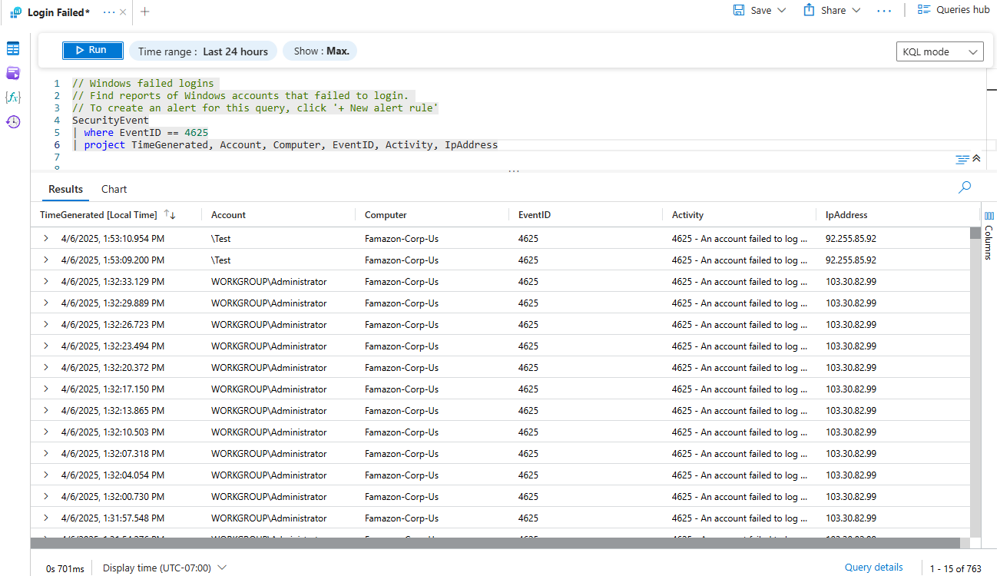
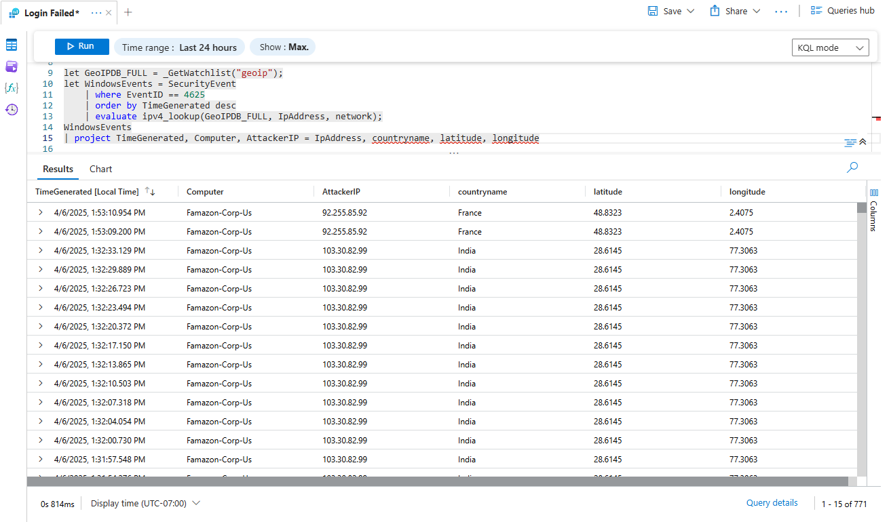
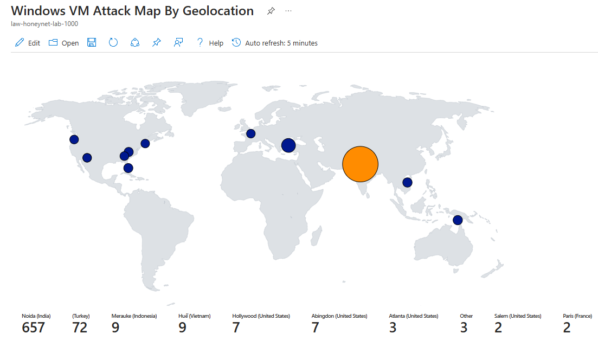

# 🛡️ Azure Honeypot Project: Cloud-Based Threat Detection Lab

## 📖 Overview
This project simulates a **production-like honeypot** on Microsoft Azure that is open to the public internet to attract **brute-force attacks**. Using **Microsoft Sentinel** and **Log Analytics**, it enables live detection and geolocation of attack sources—perfect for SOC training, threat hunting, and real-world cyber defense practice.

---

## 🧱 Architecture Diagram


---

## ⚙️ Cloud Infrastructure

| Component                | Purpose                                      |
|--------------------------|----------------------------------------------|
| Azure VM                 | Runs Windows Server and acts as the honeypot |
| Network Security Group   | Add a custom inbound rule to intentionally expose the honeypot to the public internet    |
| Public IP                | Connects attackers to VM                     |
| Log Analytics Workspace  | Ingests Windows Event Logs                   |
| Microsoft Sentinel       | SIEM layer for alerting & dashboards         |
| GeoIP Watchlist          | CSV-based mapping of IPs to countries        |
| KQL Queries              | Powers data analysis and alert triggers      |

---

## 📌 Implementation Guide

## Step 1: Set Up Azure Environment

- Create an Azure **Resource Group**
- Create a **Virtual Network**
- Create & deploy a **Virtual Machine** inside the resource group (this will be your honeypot)
  - Attach the VM to the **Virtual Network (VNet)** created earlier
  - Check the `Delete public IP and NIC when VM is deleted` option
  - Diasble **Boot diagnostics**
- Configure the **Network Security Group (NSG)** by creating a new **Inbound Security Rule** allowing any connection from any IP address to any port
- Turn off the VM firewall

> 💡 **Note:** With a $200 free credit you have from the Azure subscription, you would like to go with a decent but not too beefy VM for the sake of performance (I suggest the Standard D2s_v3 and the Premium SSD option)

---

## Step 2: Create Log Repository

- Create a **Log Analytics Workspace**
- Create a **Microsoft Sentinel** instance
- Add the previously created LAW to link it with the Microsoft Sentinel instance

---

## Step 3: Connect VM to LAW

- In the Sentinel instance's portal, navigate to **Content Hub**
- Search for \*Windows Security Events"" and install it
- Configure **data connectors** (Windows Security Events) using `Windows Security Events via AMA`
  - Create a data collection rule to collect all security events from the virtual machine

---

## Step 4: Upload GeoIP Watchlist

- Prepare a `geoip-summarized.csv` file with IP ranges and locations
- Go to **Sentinel → Configuration → Watchlists**
- Upload the file and assign it the alias: `geoip`

---

## Step 5: Write and Run KQL Queries

- Within the **Log Analytics Workspace**, choose the workspace that you created to start monitoring logs
- Query failed login attempts using:

```kql
SecurityEvent
| where EventID == 4625
| project TimeGenerated, Account, Computer, EventID, Activity, IpAddress
```



- To observe geographic information to see where the attacks are coming from, run:

```kql
let GeoIPDB_FULL = _GetWatchlist("geoip");
let WindowsEvents = SecurityEvent
    | where EventID == 4625
    | order by TimeGenerated desc
    | evaluate ipv4_lookup(GeoIPDB_FULL, IpAddress, network);
WindowsEvents
| project TimeGenerated, Computer, AttackerIP = IpAddress, countryname, latitude, longitude
```



---

## Step 6: Build Attack Map and Dashboards

- Go to **Sentinel → Threat management → Workbooks** to add a new workbook
- Remove the workbooks that are automatically generated by Azure
- Click **Addl → Add Query → Advanced Editor** then paste the JSON below inside the box then hit **Done Editing**. You should see the attack map

```json
{
  "type": 3,
  "content": {
    "version": "KqlItem/1.0",
    "query": "let GeoIPDB_FULL = _GetWatchlist(\"geoip\");\nlet WindowsEvents = SecurityEvent;\nWindowsEvents | where EventID == 4625\n| order by TimeGenerated desc\n| evaluate ipv4_lookup(GeoIPDB_FULL, IpAddress, network)\n| summarize FailureCount = count() by IpAddress, latitude, longitude, cityname, countryname\n| project FailureCount, AttackerIp = IpAddress, latitude, longitude, city = cityname, country = countryname,\nfriendly_location = strcat(cityname, \" (\", countryname, \")\");",
    "size": 3,
    "timeContext": {
      "durationMs": 2592000000
    },
    "queryType": 0,
    "resourceType": "microsoft.operationalinsights/workspaces",
    "visualization": "map",
    "mapSettings": {
      "locInfo": "LatLong",
      "locInfoColumn": "countryname",
      "latitude": "latitude",
      "longitude": "longitude",
      "sizeSettings": "FailureCount",
      "sizeAggregation": "Sum",
      "opacity": 0.8,
      "labelSettings": "friendly_location",
      "legendMetric": "FailureCount",
      "legendAggregation": "Sum",
      "itemColorSettings": {
        "nodeColorField": "FailureCount",
        "colorAggregation": "Sum",
        "type": "heatmap",
        "heatmapPalette": "greenRed"
      }
    }
  },
  "name": "query - 0"
}
```



---

## Step 7: (Optional) Add Alerts and Automation

- Create **alerts** for multiple failed logins from same IP
- Use **Logic Apps** for auto responses (e.g., email or Slack alert)

---

